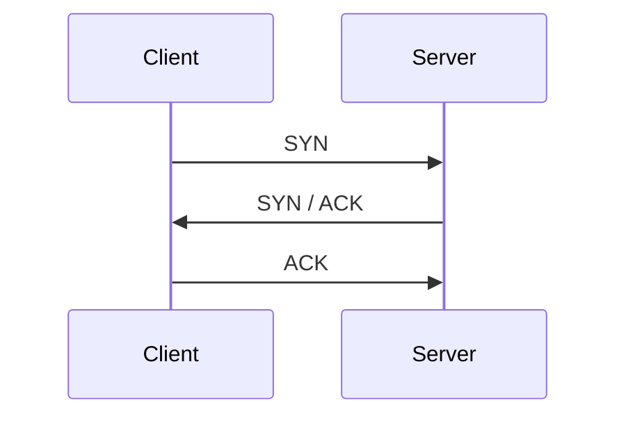

# Transmition Control Protocol (TCP)

Allows you to reliably stream data between nodes on a network.

TCP overcomes the effects of packet loss and receiving packets out of order.

Packet loss occurs when data fails to reach its destination.

TCP adapts its data transfer rate to make sure it transmits data as fast as possible while keeping dropped packets to a minimum. This is known as flow control. It makes up for the deficiencies of the underlying network media. 
TCPs reliability is generally dependant on its underlying network hardware.

TCP keeps track of received packets and retransmits unacknowledged packets.
Recipients can receive packets out of sequence. TCP organises unordered packets and processes them in sequence. 

## Working with TCP Sessions

TCP sessions allow you to deliver a stream of data of any size to a recipient and receive confirmation that the recipient received the data. Streaming allows the sender to receive feedback from the recipient while the transfer is taking place so errors can be corrected in real-time.

### Establishing a session with a TCP handshake

TCP connections use a three-way handshake between the client and server. The handshake creates an established TCP session over which to exchange data. The handshake process consists of three messages:



Before establishing a connection the server must listen for incoming connections. 
The clent sends a `synchronise` (SYN) packet to the server which informs the server of the client's capabilities and preferred window settings for the rest of the conversation.
The server responds with both an acknowledgement (ACK) and corresponding SYN flags set which informs the client that the server acknowledges receipt of the client's message.
The client then replies with an ACK message which completes the handshake.

Tools such as `wireshark` can be helpful in observing these TCP messages.

### Receive buffers and window sizes

Before the server can send the ACK, it must first send a receive buffer to indicate how much space it has available.
A receive buffer is a block of memory reserved for incoming data on a network connection. This allows a node to accept a certain amount of data from the network withouth requiring an application to read the data. 
Both the client and server maintain their own per-connection receive buffer.

The ACK packet contains a piece of information known as the `window size` which indicates the number of bytes the sender can transmit without requiring acknowledgment. A window size of 0 indicates that the receiver's buffer is full and cannot receive any additional data.

### Gracefully terminating TCP sessions

Gracefully terminating a TCP session involves a sequence of packets. This can be initiated by either the client or server by sending a finish (FIN) packet.

```mermaid
sequenceDiagram
Client ->> Server: FIN
Server ->> Client: ACK
Server ->> Client: FIN
Client ->> Server: ACK

### Less Graceful Terminations

If the connection between both nodes is servered (e.g. one of the nodes crashes) the TCP connection is immediately closed. This prompts the closed side of the connection to return a reset (RST) packet.
This paket informs the sender that the receiver's side of the connection closed and will no longer accept data. The sender then closes its side of the connection. These RST packets can be sent by intermediate nodes (such as firewalls) which terminates the socket from the middle.


